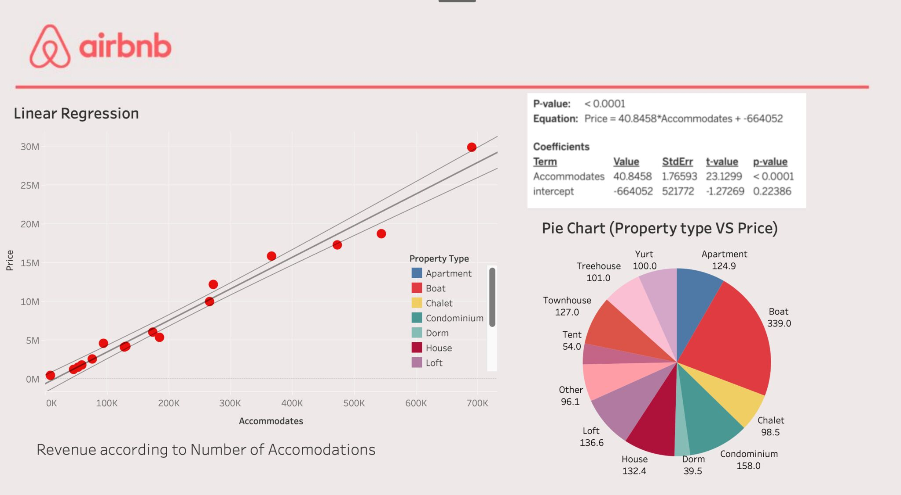
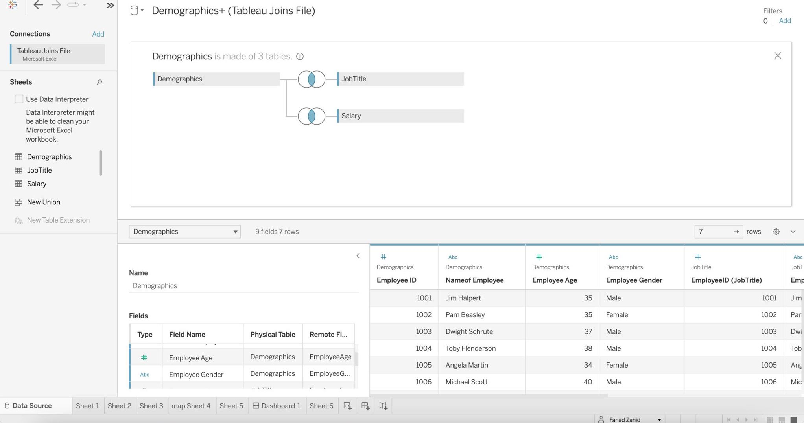
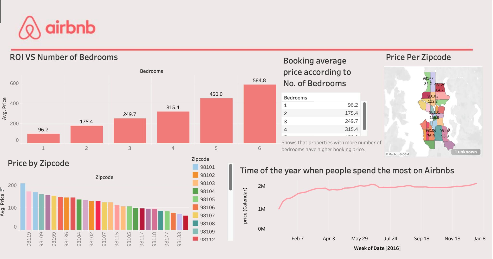
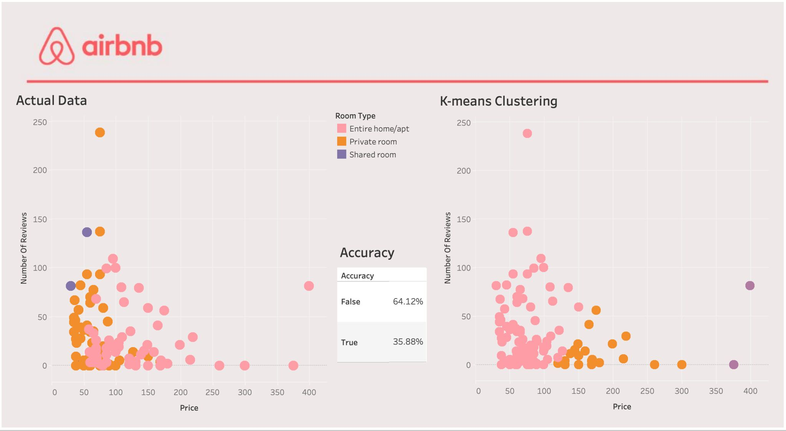

# Tableau-Airbnb-Data-Storytelling

## Uncovering Hidden Patterns and Insights

This GitHub repository contains the code and resources for performing data analysis on the Airbnb dataset using Tableau. In this project, we explore the Airbnb data to uncover insights, trends, and patterns related to the rental market.

### Dataset
The dataset used in this analysis is sourced from kaggle.com Airbnb Seattle and includes information about listings, bookings, reviews, and other relevant data. It provides a comprehensive view of the Airbnb ecosystem, enabling us to gain valuable insights into rental trends and customer behavior.

### Analysis Highlights

Visualizing geographic distribution of Airbnb listings
Exploring price variations and seasonal trends
Analyzing customer reviews and ratings
Identifying popular amenities and their impact on bookings
Predictive modeling for price forecasting

### Getting Started

To get started with this project, follow these steps:

Clone the repository: git clone https://github.com/fahad0071/Tableau-Airbnb-Data-Storytelling.git
Install the required dependencies and libraries.
Preprocess the dataset using the provided Jupyter notebooks.
Explore the visualizations and dashboards in the visualizations directory.
For detailed instructions and code explanations, please refer to the documentation in the docs folder.

### Contributing

Contributions are welcome! If you'd like to contribute to this project, please follow these guidelines:

Fork the repository and create a new branch.
Make your changes and ensure they're properly documented.
Submit a pull request with a detailed description of your changes.

I hope that this repository provides valuable insights and visualizations derived from the Airbnb dataset using Tableau. Please feel free to explore, contribute, and use the findings to enhance your understanding of the rental market.

For any questions or suggestions, please reach out to us. Happy analyzing!

LinkedIn : https://www.linkedin.com/in/
Tableau Public: https://lnkd.in/dh5kVRAw

